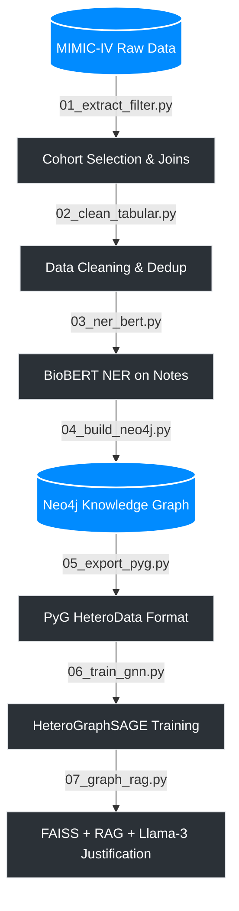

# 🏥 Hybrid Medical Knowledge Graph for Clinical Prediction

> **Master's Thesis Project (PFE) — USTHB**
> 
> A complete pipeline predicting in-hospital mortality and generating explainable, plain-language medical justifications using MIMIC-IV, Graph Neural Networks (GNNs), and Retrieval-Augmented Generation (RAG).


---

## 📑 Table of Contents
- [What this project does](#-what-this-project-does)
- [Pipeline Overview](#-pipeline-overview)
- [Data Source](#-data-source)
- [Tech Stack](#-tech-stack)
- [Project Structure](#-project-structure)
- [Getting Started](#-getting-started)
- [Output Artifacts](#-output-artifacts)
- [Authors](#-authors)

---

## 🎯 What this project does

This system predicts clinical outcomes for hospitalized patients and explains those predictions in plain medical language. It achieves this by bridging three domains that are traditionally kept separate: **structured clinical data**, **free-text medical notes**, and **graph-based machine learning**.

**The Workflow:**
1. Ingests raw data from **MIMIC-IV** (a large real-world hospital database).
2. Builds a heterogeneous knowledge graph connecting patients, diagnoses, medications, procedures, and lab results.
3. Trains a **Graph Neural Network (HeteroGraphSAGE)** to predict in-hospital mortality.
4. Uses a RAG pipeline powered by **Llama-3** to justify each prediction by referencing similar past patients.

---

## ⚙️ Pipeline Overview



---

## 📊 Data Source

This project utilizes [MIMIC-IV](https://physionet.org/content/mimiciv/), a freely available critical care database from Beth Israel Deaconess Medical Center. *Note: Access requires formal credentialing through PhysioNet.*

---

## 🛠 Tech Stack

| Category | Tools & Libraries |
| :--- | :--- |
| **Data Processing** | `pandas`, `numpy`, `tqdm` |
| **Clinical NLP / NER** | HuggingFace Transformers (`d4data/biomedical-ner-all`) |
| **Graph Database** | Neo4j, Cypher |
| **Graph ML** | PyTorch, PyTorch Geometric (HeteroGraphSAGE) |
| **Similarity Search** | FAISS |
| **LLM & Prompting** | Llama-3 70B (via Groq API) |
| **Environment** | YAML, `python-dotenv` |

---

## 📁 Project Structure

```text
LLM-KnowledgeGraph-ETL-Pipeline-Masters-Graduation-Project/
├── data/
│   ├── kaggle/
│   │   ├── heterosage_mortality.pth
│   │   └── mimic_graph (1).pt
│   └── processed/           
│       ├── cleaned_*.csv
│       ├── filtered_*.csv
│       ├── heterosage_mortality.pth
│       ├── mimic_graph.pt
│       └── nlp_enriched_properties.json
├── src/
│   ├── 01_extract_filter.py
│   ├── 02_clean_tabular.py
│   ├── 03_ner_bert.py
│   ├── 04_build_neo4j.py
│   ├── 05_export_pyg.py
│   ├── 06_train_gnn.py
│   └── 07_graph_rag.py
├── .env                     
├── .gitignore
├── config.yaml
├── main.py
├── README.md
└── requirements.txt
```

---

## 🚀 Getting Started

### 1. Install Dependencies
Ensure you are using your `.venv` virtual environment, then install the required packages:

```bash
pip install -r requirements.txt
```

*(Alternatively, manually install core components: `pandas`, `torch`, `torch-geometric`, `neo4j`, `transformers`, `groq`, `faiss-cpu`)*

### 2. Configure Paths
Update `config.yaml` to match your local setup and data paths.

### 3. Environment Variables
Ensure your `.env` file contains your secure credentials:
```env
NEO4J_PASSWORD=your_neo4j_password
GROQ_API_KEY=your_groq_api_key
```

### 4. Database Initialization
Ensure a Neo4j instance is running (locally or remotely) before executing scripts `04` and `07`.

### 5. Running the Pipeline
You can run the full pipeline or individual scripts from the `src/` directory:

```bash
cd src
python 01_extract_filter.py
# ... proceed sequentially ...
python 07_graph_rag.py          
```

---

## 📦 Output Artifacts

| Artifact | Description |
| :--- | :--- |
| `filtered_*.csv` & `cleaned_*.csv` | Pre-processed MIMIC-IV cohort tables |
| `nlp_enriched_properties.json` | Parsed NER outputs per admission |
| `mimic_graph.pt` | Compiled PyG HeteroData graph |
| `heterosage_mortality.pth` | Trained GNN model weights |

---

## 🚫 `.gitignore` Reference

The repository is configured to exclude sensitive data, heavy files, and IDE configurations:

```text
# Security
.env

# Python
__pycache__/
*.py[cod]
.venv/
venv/

# Data (Too big for GitHub)
MIMIC-Demo-DB/
*.csv
*.pt
data/

# IDE
.idea/
.vscode/

# Build artifacts (for your future exe)
build/
dist/
*.spec
```

---

## 🎓 Authors

Developed as part of a Master's final year project (PFE) at **USTHB, Algiers**.

*Supervised by:* * **Dr. Lamia Berkani** * **Dr. Nabila Berkani**
